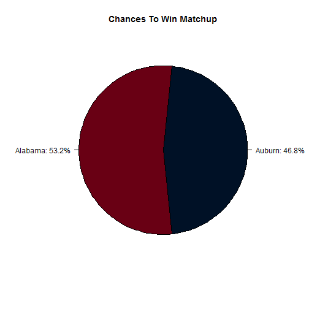

College Football Matchup Predictor
========================================================
author: Alok Pattani, ESPN Stats & Information  
date: October 26, 2014
transition: rotate

Football Power Index (FPI)
========================================================
left: 75%

Predictive rating system for all college football teams in the Football Bowl Subdivision (FBS), created by ESPN Stats & Information

- Measures team strength going forward for rest of season
- Represents expected point margin vs average opponent on neutral field (avg is 0)
- Allows for prediction of single game, rest of team's schedule, conference races, etc.

For more information on FPI, see Dean Oliver's introduction [here](http://espn.go.com/blog/ncfnation/post/_/id/97373/fpi-to-look-ahead-it-looks-back).

***
  

Most Recent FPI Top Teams
========================================================


### Top 10 Teams in FPI as of 10/26/2014 4:00

```
 FPI Rank              Team  FPI
        1           Alabama 27.5
        2            Auburn 26.2
        3          Ole Miss 25.6
        4           Georgia 24.4
        5 Mississippi State 23.4
        6     Florida State 23.3
        7            Oregon 23.1
        8          Oklahoma 22.6
        9        Ohio State 21.7
       10               TCU 21.2
```

See the latest FPI for all teams [here](http://espn.com/fpi).

Matchup Predictor
========================================================
- Select season, 2 teams of interest, and site of matchup (home, road, or neutral)
- Uses each team's most updated FPI of given season and home-field advantage factor
- Gives percentage chances for each team in any scheduled or hypothetical matchup
- Displays percentages in pie chart with each team's main color

Matchup Predictor Example
========================================================

<small>Current FPI #1 Alabama vs #2 Auburn at Neutral Site<small>
 

Try the matchup predictor for yourself [here](https://adp2223.shinyapps.io/FPIMatchupPredictor/)!
